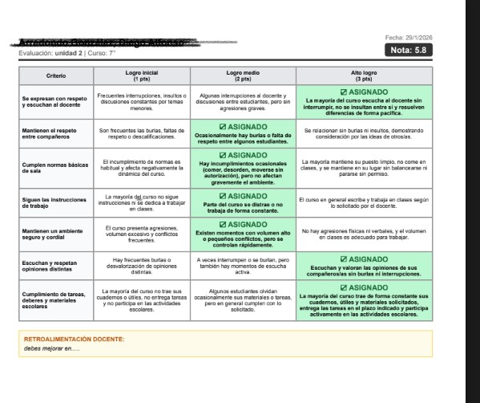

# 🦅 RubricAPP - Gestor de Rúbricas Inteligente

**RubricAPP** es una aplicación web moderna desarrollada sobre la plataforma **Google Apps Script (GAS)**, diseñada para facilitar a los docentes la creación, gestión y aplicación de rúbricas de evaluación de manera eficiente e inteligente.


## Ingresa a la app: https://sites.google.com/view/rubricapps/inicio

## 🚀 Características Principales

### 🧠 Inteligencia Artificial (Gemini)

- **Generación Automática:** Describe el objetivo de evaluación (ej: "Ensayo sobre el ciclo del agua para 4° básico") y la IA generará una rúbrica completa con criterios y niveles.
- **Importación de Documentos:** Sube tu prueba o guía en PDF/Word y la IA extraerá los criterios de evaluación automáticamente.

### 📝 Gestión de Rúbricas

- **Editor Visual:** Interfaz intuitiva para crear rúbricas desde cero, añadir criterios y editar niveles de desempeño.
- **Banco de Rúbricas:** Guarda tus rúbricas localmente para reutilizarlas en múltiples cursos.
- **Gestión Avanzada:** Renombra, edita y asigna rúbricas a evaluaciones específicas.

### 🎓 Gestión Académica

- **Cursos y Estudiantes:** Crea cursos y gestiona listados de estudiantes de forma rápida.
- **Evaluaciones:** Crea múltiples evaluaciones por curso (Pruebas, Trabajos, etc.).
- **Seguridad de Datos:** El sistema protege la integridad de las calificaciones impidiendo cambios de rúbrica en evaluaciones ya corregidas.

### ⚡ Corrección y Calificación

- **Calculadora Interactiva:** Selecciona los niveles de logro haciendo clic en la matriz de rúbrica.
- **Calculadora de Notas:** Conversión automática de puntaje a nota (Escala configurable, por defecto 60% exigencia).
- **Feedback:** Campo dedicado para retroalimentación cualitativa.
- **Exclusión de Criterios:** Posibilidad de "omitir" ciertos criterios ("ojito") para estudiantes con adecuaciones curriculares (PIE).

### 📄 Reportes

- **Exportación PDF/DOCX:** Genera informes detallados por estudiante con su nota, desglose de puntaje y feedback listo para imprimir o enviar.

## 🛠️ Tecnologías

- **Backend:** Google Apps Script (`.gs`).
- **Frontend:** HTML5, TailwindCSS (vía CDN), Vanilla JavaScript.
- **Base de Datos:** Google Sheets (oculta, gestionada vía API interna).
- **AI Engine:** Google Gemini Pro (vía API).
- **PDF Engine:** Servicio interno de conversión de HTML a PDF.

## 📂 Estructura del Proyecto

```
Rubrica/
├── backend/            # Lógica del servidor (GAS)
├── frontend/           # Vistas y lógica del cliente
│   ├── client-js/      # Controladores JavaScript (Lógica de negocio frontend)
│   ├── components/     # Componentes UI reutilizables
│   ├── styles/         # Estilos Tailwind y CSS personalizado
│   └── views/          # Módulos principales (Grading, Editor, Dashboard)
└── appsscript.json     # Manifiesto del proyecto
```

## 🔧 Instalación y Despliegue

Este proyecto utiliza `clasp` para el desarrollo local.

1.  **Clonar:** `git clone <repo>`
2.  **Instalar dependencias:** `npm install`
3.  **Login GAS:** `npx clasp login`
4.  **Subir código:** `npx clasp push`
5.  **Abrir:** `npx clasp open`

---
Desarrollado para potenciar la labor docente mediante tecnología inteligente.


---

## 📊 RubricApp: Gestión Profesional de Rúbricas en tu Drive

![RubricApp hero][def]


### 📝 Descripción

RubricApp es una herramienta de evaluación diseñada para docentes que priorizan la autonomía digital. A diferencia de las plataformas cerradas, esta aplicación funciona directamente sobre tu infraestructura de Google, permitiéndote gestionar, almacenar y organizar todas tus evaluaciones dentro de tu propio ecosistema de Google Drive.

### 🚀 Características Principales

- **Sincronización Automática con Drive:** Todas las rúbricas y resultados se guardan instantáneamente en tu unidad personal, permitiéndote una gestión total de los archivos.

- **Soberanía de Datos:** Tú eres el dueño de la información. El sistema utiliza tus propias hojas de cálculo como base de datos, sin intermediarios.

- **Generación Ágil de Rúbricas:** Interfaz intuitiva para definir criterios y niveles de logro de forma rápida.

- **Cálculo de Notas:** Conversión automática de niveles de desempeño a escalas cuantitativas personalizables.

### 🛠️ Tecnologías Utilizadas

- **Core:** JavaScript (Google Apps Script).

- **Backend:** Google Sheets API & Google Drive API.

- **Frontend:** HTML5, CSS3 y JavaScript para una experiencia fluida en el navegador.

### 📁 Gestión de Archivos

Al instalar RubricApp, el sistema crea una estructura de carpetas en tu Drive donde podrás:

- **Organizar por Periodos:** Mover y renombrar los archivos de evaluación según el año o semestre.

- **Acceso Offline:** Al ser archivos de Google Sheets, puedes acceder a los resultados incluso sin conexión si tienes habilitada la función en Drive.

- **Seguridad:** El control de acceso depende de tus permisos de Google, asegurando que solo tú o las personas que autorices vean los datos.

### ⚙️ Instalación

1. Copia el código de los archivos `.gs` y `.html` en un nuevo proyecto de Google Apps Script.
2. Vincula el proyecto a una Hoja de Cálculo de Google.
3. Otorga los permisos necesarios para que la aplicación pueda escribir archivos en tu Google Drive.
4. Ejecuta la función `onOpen` para activar el menú de RubricApp en tu planilla.

### 👤 Autor

Jean Claudio Concha Basualto — Profesor de Educación Básica & Desarrollador EdTech

Optimiza tu tiempo docente manteniendo el control total de tus documentos pedagógicos.


[def]: assets/rubrica-hero.png